# OpenCTI homelab setup guide

## 1. Introduction

Cyber Threat Intelligence (CTI) has become a critical point for modern protection of the cyber space. With the increasing volume and continuous modernization of TTPs, threat groups and IOCs, security teams need to have a clear understanding of where and how to protect, but also to have a structured way of sharing intelligence. OpenCTI is an open-source solution designed to centralize threat intelligence, enrich observables, and provide actionable insights for both CTI analysts and SOC teams.
I first had the opportunity to use OpenCTI while doing the “OpenCTI” room on TryHackMe, in the process of completing the “Cyber Threat Intelligence” module. That room provided practical experience to the platform’s capabilities and how it can be applied in real-world investigations. What caught my attention was the fact that OpenCTI can be self-hosted, giving organizations full control over their threat intelligence environment. Driven by this idea, I decided to see if I could deploy OpenCTI in my own homelab to explore its setup, connectors, and practical usage.
This tutorial goes through this deployment and setup process, including enabling some connectors. The hope is to provide an understandable guide that not only helps others replicate the installation, but also demonstrates how OpenCTI can be used for investigations, enrichment, and intelligence sharing.

## 2. Prerequisites

OpenCTI is readily available to be run as a Docker container, so we just need an environment for it to run on. For my homelab, I already have a mini pc with proxmox, so I can easily just spin up a VM to run my docker containers on. I will not go over the steps of installing proxmox and creating a new VM, as this is a very generic procedure and is well documented online. 
For the OpenCTI to run comfortably it is recommended to have available 4 CPU cores, 8 Gb RAM and 100 Gb of storage. Since the whole of my mini pc only has 4 cores and 8 Gb, and I have other services running on it (besides the proxmox itself), I had to cut it a bit short and gave the VM only 3 cores and 5.5 Gb of RAM. For the storage it has 96 Gb.

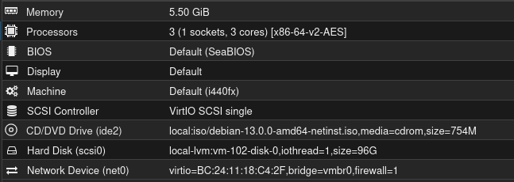

For the OS, it’s running Debian without desktop environment (DE), as I’m just connecting to it via SSH. The steps should be similar for any linux distro.

## 3. Installation

If it’s a freshly installed OS, or if you don’t do it for a long time, it’s a good idea to start by running a classic update & upgrade.

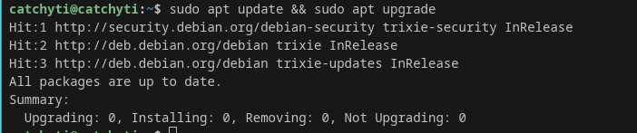

After that’s done, we can go ahead and install the needed packages:
- docker.io docker-compose, because OpenCTI will run on a Docker container
- git, to clone the OpenCTI container project
- curl, not strictly needed, just for test API calls on the terminal
- uuid-runtime, also not strictly needed, just useful to quickly generate an API key

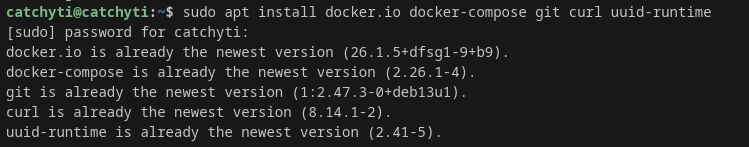

A directory is needed to clone the repository into. I have opted for creating /opt/opencti and changing it’s ownership to my current user.
From there, the repository can be cloned, if successful you should now have a new folder “docker”, and inside there are the configuration files for the container.

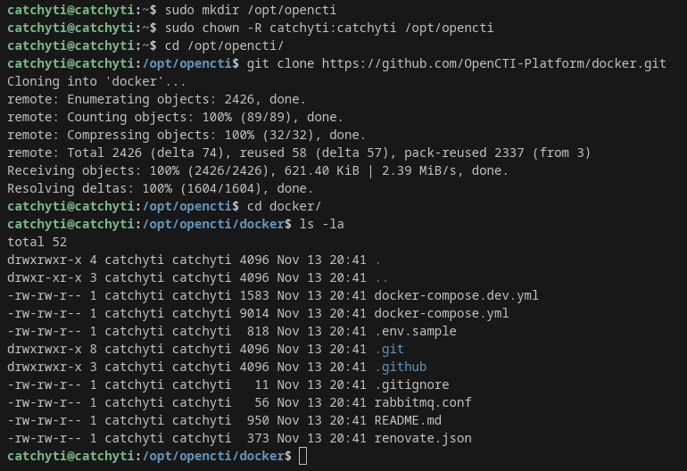

Among those files there is a “.env.sample” which we will make a copy named “.env” to be edited for our use-case. 

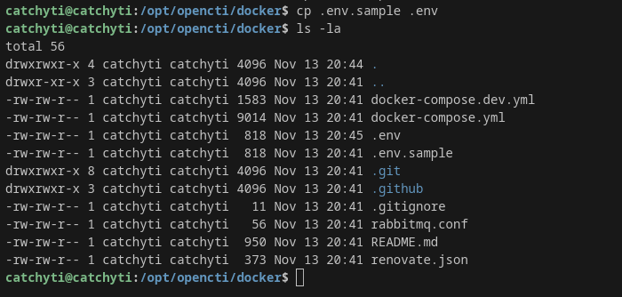

Open the newly created .env with any text editor of your choice and replace all “changeme” fields with your desired config. Additionally, since my system is below the recommended hardware requirements, I have limited Elasticsearch memory usage.
If you don’t want to invent API keys on your own, you can use the uuid package we have installed, just by running the command “uuidgen”.

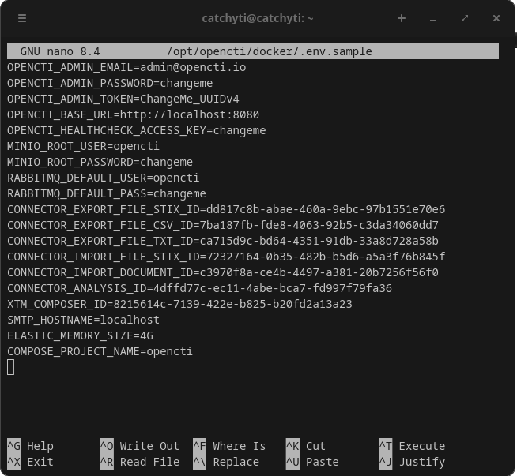
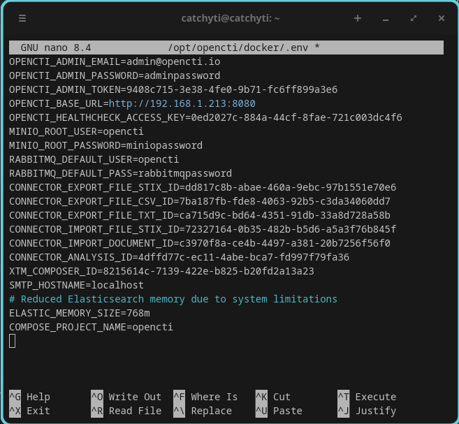

PS: I know there are keys visible. But this is a local instance, not publicly accessible, and the keys are already obsolete by the time of posting here.

In my particular case, I have further gone ahead and limited the CPU usage of each individual service (Elastic - 1, OpenCTI - 1, RabbitMQ - 0.5) by editing the “docker-compose.yml” file. Example for Elastic service:

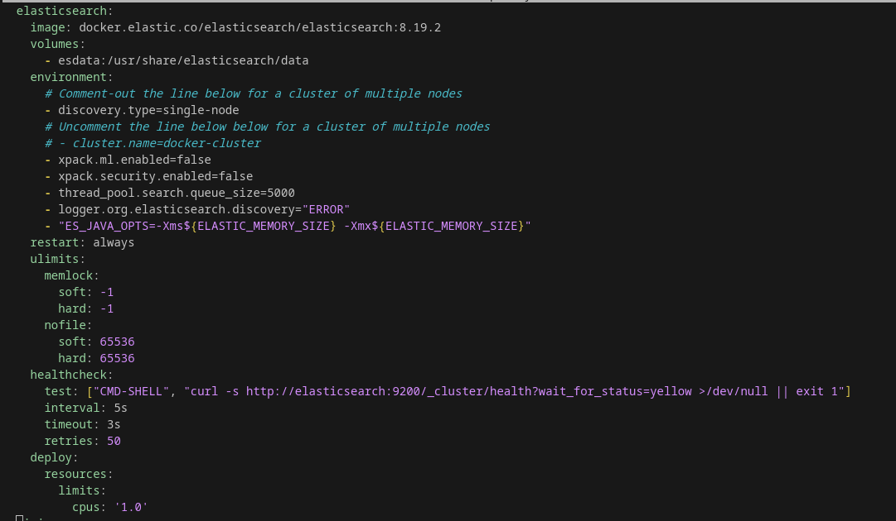

At this point, we should be in good condition to start our Docker containers.

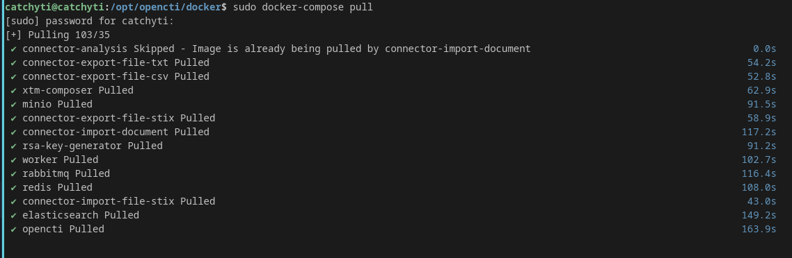

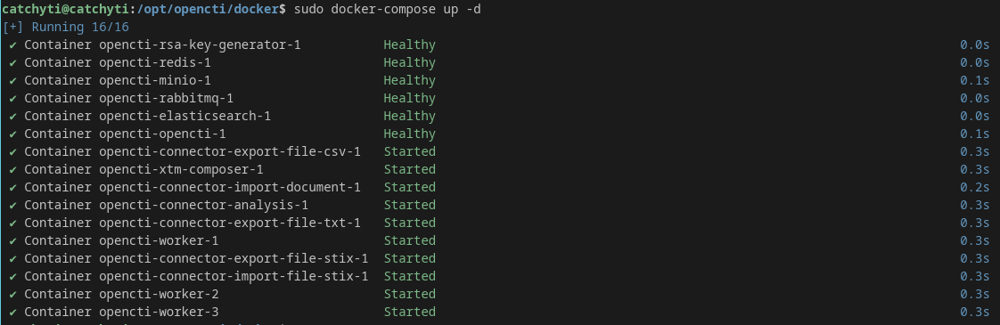

If everything went good all containers should have started and there should be no errors. You can now try to access OpenCTI via browser from a machine on the same LAN, a login page should be visible and you may access with the admin credentials you have defined on the “.env” file.

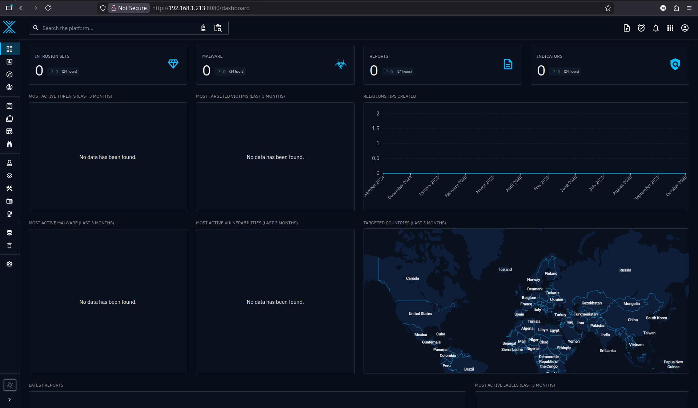

If you have reached this, congratulations, you now have an OpenCTI instance running locally! Although you may notice it has no info to display. We will fix that by implementing some connectors to allow it to pull some information from free online resources on the next steps.

## 4. Troubleshooting

Because it’s normal that not everything goes to plan at first try, I have faced an issue when first tried to run “docker-compose up -d”, where the “opencti-minio-1” container was giving an error. In case you face a similar scenario, best course of action is to check directly the logs for the container, it may provide useful info for your troubleshoot.

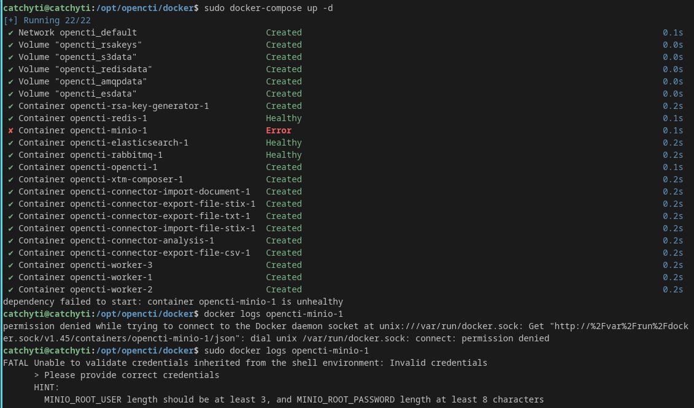

In my case, the issue was that the password I had defined in the “.env” file for the MINIO_ROOT_USER was not meeting the requirements, although it had more than 8 characters. So issue seems to be on user credentials, but not on the length directly. After some research I found that besides 8 characters, it must contain letters and numbers. After changing again the “.env” and adding numbers to the password this error was overcome.

## 5. Connector Setup (VirusTotal, MITRE)

Now it’s time to setup some connectors to enrich our OpenCTI platform. For the purpose of this POC, I have decided to go with VirusTotal and Mitre because they are very well known sources, they have free options available, and from a system perspective they will not need higher resources than what we already have, as opposed to, for example, having to setup a whole MISP instance to connect to OpenCTI. There is a repository with templates to implement multiple possible connectors for OpenCTI. Let’s clone this repository to some directory to be able to retrieve what we might need.

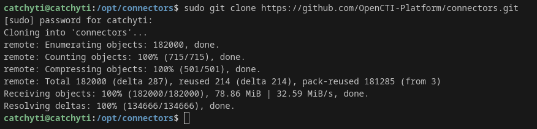

For the VirusTotal connector, we will use the template on ./internal-enrichment/virustotal-downloader and adjust to our requirements. Taking a quick glance at the compose file available there we can see the required parameters.

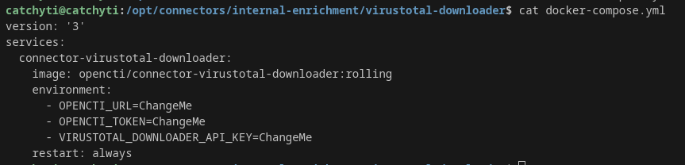

Now let’s create a .env file to set our parameters. For the VirusTotal API key, you can get one (with limitations) from a free account on VirusTotal, but it is enough for our purpose. The OpenCTI token is the OPENCTI_ADMIN_TOKEN you have defined on the .env file of the OpenCTI docker.

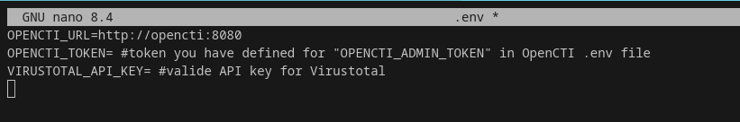

Now we need to go back on the docker compose file and reference to our defined variables. 

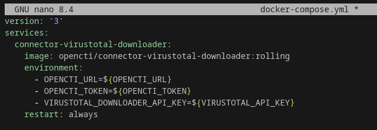

Now it’s ready to run.

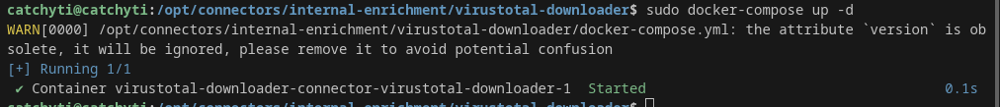

You should start to see your OpenCTI instance getting populated with data and a new entry in “Data”→”Ingestion” for “VirusTotal Downloader”.
For the Mitre connector we follow the same workflow using the template on ./external-import/mitre, with the easiness that Mitre is open and you don’t need to create any account or additional API key, the .env will only have the OpenCTI URL and Admin key.
For the docker compose file, we can tweak some additional settigs.

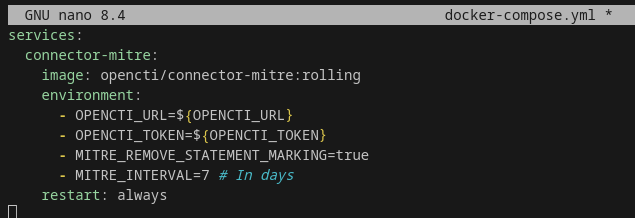

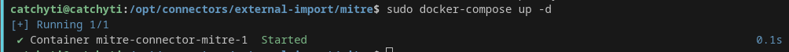

Our OpenCTI instance is now having a better look and can now be indeed useful.

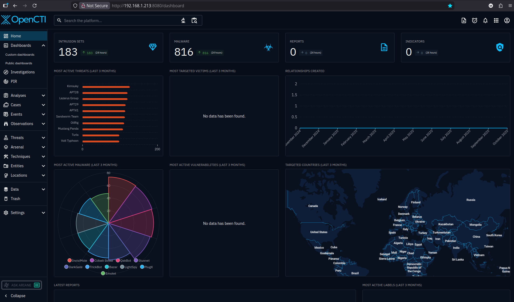

## 6. Use Cases

With the platform up and running, and a couple of connectors feeding data, it’s worth briefly touching on how OpenCTI can be used in practice. In a corporate environment, analysts might rely on it to enrich observables, pivot between related entities, or map adversary behavior against MITRE ATT&CK techniques. The real power comes when validated IOCs and TTPs are shared with SOC teams, who can then use them for detection and response. I won’t go too deep here since this tutorial is focused on deployment, but if you’re curious about day‑to‑day usage, I highly recommend the OpenCTI room on TryHackMe. It’s part of the Cyber Threat Intelligence module and provides excellent hands‑on exercises that originally inspired me to try self‑hosting OpenCTI in the first place.

## 7. Next Steps

First on the improvements side, as our connector list grows, it can become messy to follow all the folders where we have them running, and managing all parameters in all those “.env” files, or having to start them all in case they stop for some reason. Having all aggregated in the single .env and compose files of our OpenCTI will allow to start and manage everything in a single place. Of course with the disadvantage of having less isolation and flexibility, but if we have fully tested them and everything is setup, it could be good to have everything combined.
For this, we need to add any missing parameter to the .env file of our OpenCTI and add the relevant lines from the compose files to the OpenCTI compose file. Below is a picture of a snippet of the compose file of OpenCTI with the added connectors.
If you want to deploy an instance I recommend you to follow all steps and troubleshootings. But in case you are lazy, I have left templates of the final OpenCTI compose file and .env that you can just copy and adjust the .env file.

📄 Example OpenCTI docker compose file (w/ VT and Mitre connectors): [docker-compose.yml](config/docker-compose.yml)

📄 Corresponding example .env: [.env](config/.env)

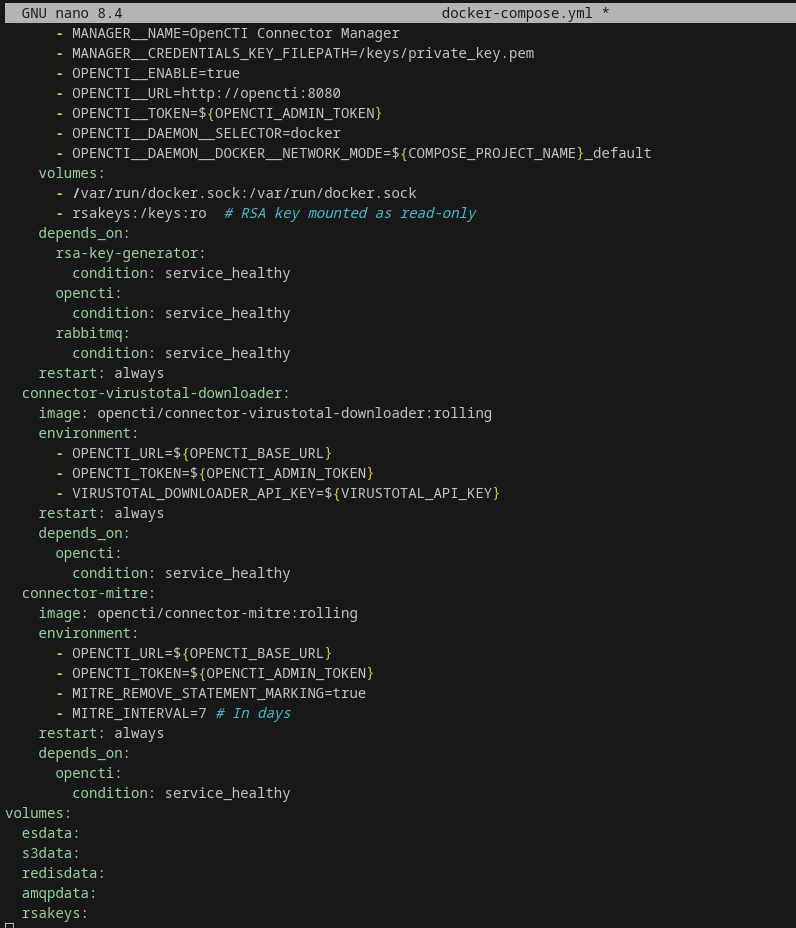

Beyond merging the connector files for easier management, a logical next step is to expand the ecosystem by adding more connectors. MISP would be a strong candidate since it’s widely used for community‑driven threat sharing, though in my case hardware limitations prevent me from spinning up a local instance right now. Other lightweight options include connectors for CVE/NVD to bring in vulnerability intelligence, or AlienVault OTX for community IOCs. 
Over time, and looking into more enterprise setups, integrating OpenCTI with a SIEM or EDR platform can also help close the loop, allowing intelligence gathered here to directly feed detection and response workflows.

